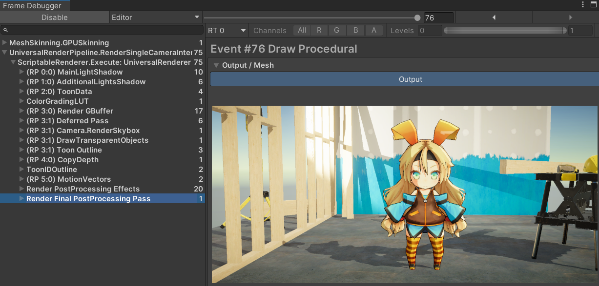

## Introduction  
Toon render pipeline modified from URP. Support deferred rendering and forward rendering, support NativeRenderPass. Not support subtractive lightingMode.  
  

## ShadingModel  
Use global ramp map to control shadow.(In "Universal RP/Textures/Toon/ToonDiffuseRamp.png").  

  

Now we have two shadingModel, Lit and SimpleLit, both modify from PBR.  

### Lit  
  
Lit must be metallic workflow. It can interpolate between PBR.

-Outline : Back face outline, Color.R control width. Support smoothNormal outline. Use bakeTool to bake smoothNormal in tangent space, and store in uv3. Add suffix "_SN" on fbx file, then check "ToonOutlineSmoothNormal" on material. BakeToolReference:https://zhuanlan.zhihu.com/p/107664564  

-Shadow : Use ToonDiffuseRampV control how to sample global ramp map.  Shadow color only in MainLight, prevent overexposure.

-DepthShadow: Sample ToonDepthTexture with offset screenUV and screenUV, then compare to get depthShadow.  

-PointShadow: In some cases, we dont want slefShadow, for example character, when disable receiveShadows, character alway in lighting, this function sample a worldSpace point in MainLightShadowMap, use control a character in lighting or not, have to setup a "ToonShadingProperty" component.  

-Specular : Only control specular feather.  

-Rim: ToonDepthTexture control rim(must enable "ToonData"), not support in forward rendering path.    

-MatCap: Add as emission.  

-ToonData: Render in ToonDepthTexture and ToonDataTexture.(Enable on Character)  

-ToonID: Use in rimLight、depthShadow、outline, set different id for different parts of the character.

### SimpleLit  
                                                                                                             
SimpleLit have more control on shadow, but simple specular.  

-Outline : Same as lit.  

-Shadow : Use ToonDiffuseRampV control how to sample global ramp map. Can control ShadowOffset and StaticShadowMap.  

-DepthShadow: Same as lit.  

-SDFShadow: Character face shadow.(Have to setup "ToonShadingProperty" component)  

-PointShadow: Same as lit.  

-Rim: Same as lit.  

-MatCap: Same as lit.  

-ToonData: Same as lit.

-ToonID: Same as lit.

## Deferred Rendering Path  

  

### Gbuffer Layout  
#### Default URP Gbuffer layout  
https://docs.unity3d.com/Packages/com.unity.render-pipelines.universal@14.0/manual/rendering/deferred-rendering-path.html  

  
#### TURP Gbuffer Layout  
Different from default URP layout:  

-Lit  
Gbuffer1: Metallic DiffuseRampV SpecularFeather Occlusion  

MaterialFlags:  
Bit 0, ReceiveShadowsOff: if set, the pixel does not receive dynamic shadows.  
Bit 1, SpecularHighlightsOff: if set, the pixel does not receive specular highlights.  
Bit 2, DepthShadowEnable: if set, the pixel sample ToonDepthTexture to get depthShadow.  
Bit 3, PointShadow. if ReceiveShadowsOff, the pixel uses check object in shadow.   

-SimpleLit  
Gbuffer1: Specular DiffuseRampV DiffuseRampOffset StaticShadow  

MaterialFlags:   
Bit 0, ReceiveShadowsOff: if set, the pixel does not receive dynamic shadows.  
Bit 1, SDFShadow: enable SDFShadow.  
Bit 2, DepthShadowEnable: if set, the pixel sample ToonDepthTexture to get depthShadow.  
Bit 3, PointShadow. if ReceiveShadowsOff, the pixel uses check object in shadow.  

## ToonData buffer  
No memoryless. (Vulkan API subpassLoad() cant load gbuffer with specific uv, we need to sample toonData with offsetuv)  
-ToonDepthTexture: 16 bit depth buffer.Use to render character rim, depthShadow.  
-ToonDataTexture: 8 bit. Store material id, use to render character depthShadow、 PostProcessOutline.  

## Setting
   

## ShaderGraph  
     
Only lit Shader, not fully feature.  

## ToneMapping
Modify ACES  (In "Core RP Library/ShaderLibrary/Color.hlsl").  
  

## Other
Forward+ RenderingPath has some problems. NativeRenderPass dont work in scene window. NativeRenderPass has bug, if scene shadow look wrong, maybe re-check NativeRenderPass in UniversalRenderer asset.  
UnityEditor 2022.2+  
Universal RP 14.0.6

## Reference  
© Unity Technologies Japan/UCL(https://unity-chan.com/)  
https://github.com/TechMiZ/ToonShadingCollection 

